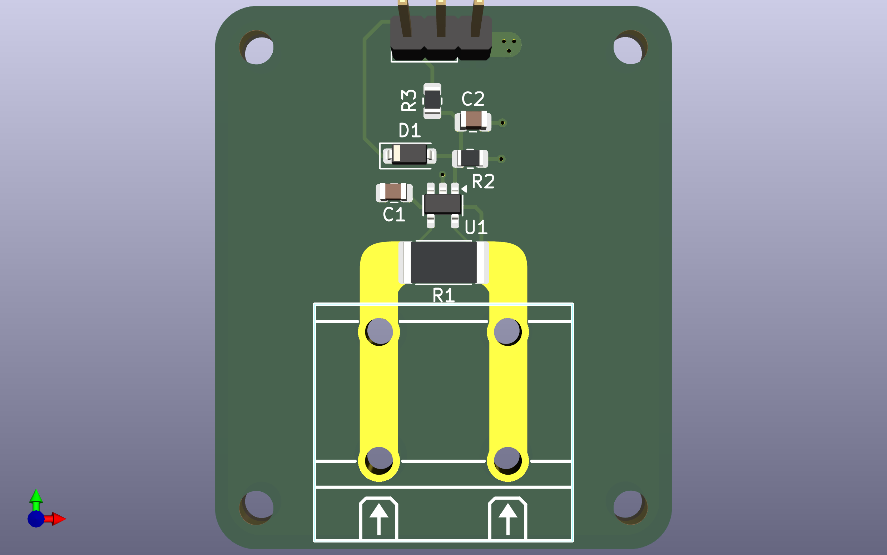
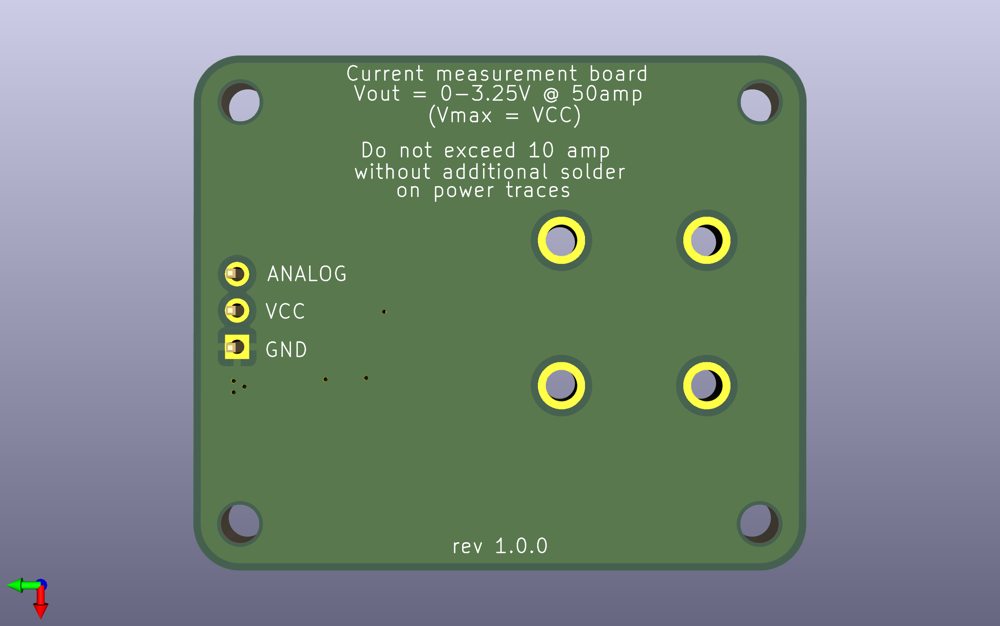
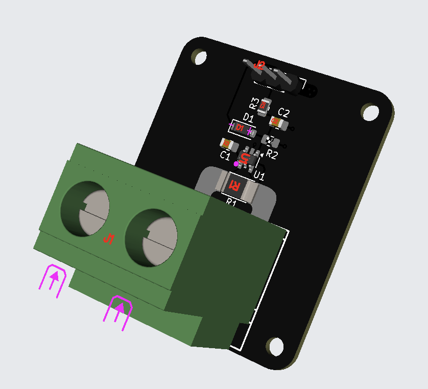
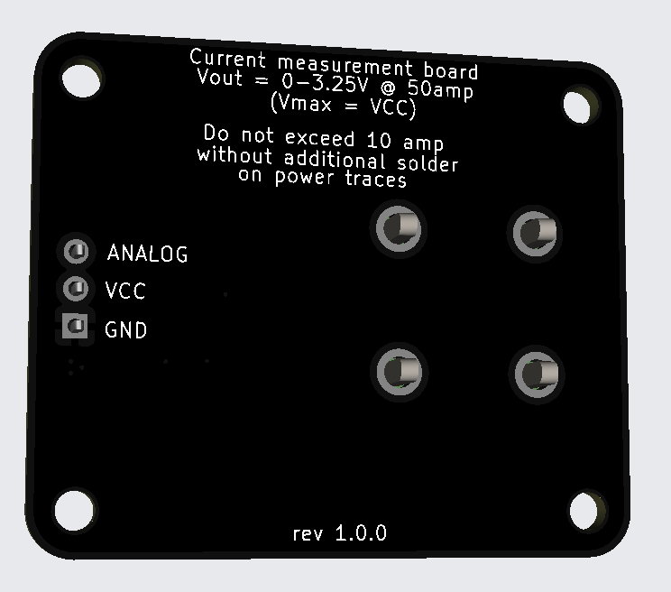

# Current measurement PCB
### AGH Space Systems entry project

*Project was built using KiCad*

This PCB is used to measure current up to 50 amps on high-side (with at least .35mm of solder applied on power traces / **10 amps max without it**).
Voltage should be between 2.7V and 60V.

Analog output of the board is between 0 and 3.25V @ 50amp (with max voltage being clamped to applied VCC).

M2.5 mounting holes are present (36.325mm x 29.500mm center to center)

## Recommended components

| Component nr.   | LCSC part nr. |         Package        |
| --------------- | ------------- | ---------------------- |
| U1              | C44322        | SOT-23-5               |
| R1              | C469426       | 2512                   |
| R2              | C2933305      | 0805                   |
| R3              | C17414        | 0805                   |
| C1              | C49678        | 0805                   |
| C2              | C53134        | 0805                   |
| J1              | C475108       | Through Hole,P=10.16mm |
| J2              | C2937625      | Through Hole,P=2.54mm  |
| D1              | C42445803     | SOD-123                |

## Images

